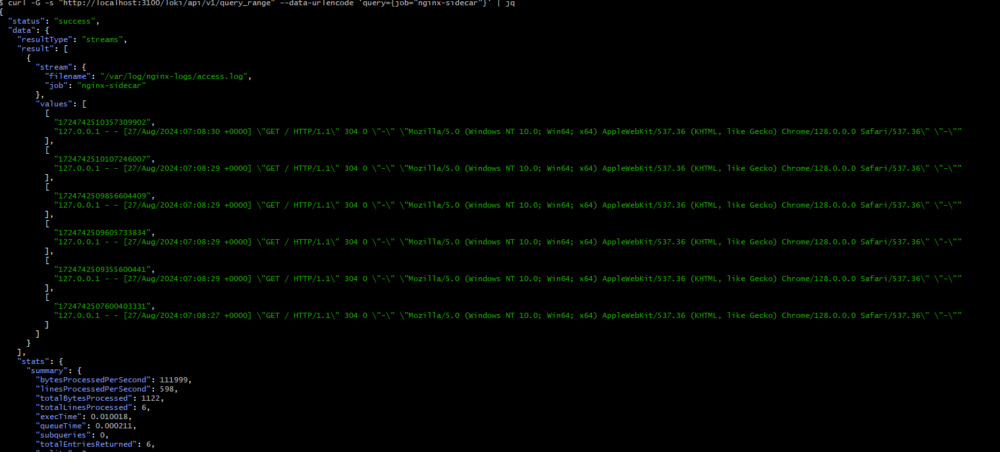

# monitor-application-logs-using-grafana-loki-&-promtailagent
```python
## Flow of Logs <----->
 The Logs that are generated inside main pod synced with promtail-sidecar container, the promtail container then pushes the logs to loki.
 After this the loki url has been used as a datasource in grafana dashboard which help to easy monitor the logs .
```
$$
application pod --> Promtail-sidecar pod --> loki --> grafana
$$
### First lets start our minikube cluster,

#### Run the following cmd in terminal

```python
minikube start
```
#### After setting up minikube cluster,

#### clone the repo & run the following cmd, 
```python
 git clone https://github.com/iammilan07/monitor-logs-using-grafana-loki-and-promtailagent-k8s.git
```
```python
cd monitor-logs-using-grafana-loki-and-promtailagent-k8s 
```
#### Create nginx & monitoring namespace
```python
kubectl create ns nginx           
namespace/nginx created
```
```python
kubectl create ns monitoring      
namespace/monitoring created
```
### Deploy Loki in minikube cluster
```python
cd loki
```
#### If you want your logs to be persistent, configure Loki to use AWS s3 bucket as a storage else leave it as it is,
#### Search for bucketnames in values.yaml file & configure the following,
````python
    bucketnames: <bucket1>
    region: <region>
    access_key_id: xxxxx
    secret_access_key: xxxxxx
````
#### Now run the following cmd, 
```python
helm install loki -n monitoring .
NAME: loki
LAST DEPLOYED: Tue Aug 27 11:12:00 2024
NAMESPACE: monitoring
STATUS: deployed
REVISION: 1
TEST SUITE: None
NOTES:
Verify the application is working by running these commands:
  kubectl --namespace monitoring port-forward service/loki 3100
  curl http://127.0.0.1:3100/api/prom/label
```
#### Ensure loki pod & svc are up & running
```python
kubectl get pods -n monitoring | grep loki
loki-0                     1/1     Running   0          3m41s

kubectl get svc -n monitoring | grep loki 
loki              ClusterIP   10.97.88.178     <none>        3100/TCP   3m56s
loki-headless     ClusterIP   None             <none>        3100/TCP   3m56s
loki-memberlist   ClusterIP   None             <none>        7946/TCP   3m56s
```

### Deploy Grafana & prometheus in minikube cluster
```python
kubectl apply -f .\grafana.yaml
deployment.apps/grafana created
service/grafana-svc created
```
```python
 kubectl apply -f .\prometheus-configmap.yaml
 kubectl apply -f .\prometheus.yaml
```
#### Ensure the grafana pods and service are up & running,</br>
```python
kubectl get pods -n monitoring
NAME                       READY   STATUS    RESTARTS   AGE
grafana-55978794c9-fdlkv   1/1     Running   0          68 

kubectl get svc -n monitoring 
NAME          TYPE        CLUSTER-IP       EXTERNAL-IP   PORT(S)   AGE
grafana-svc   ClusterIP   10.106.172.155   <none>        3000/TCP  5m29s
```
#### Now, Lets portforward the grana-svc and run it locally
```python
kubectl port-forward --namespace monitoring svc/grafana-svc 3000:3000 
Forwarding from 127.0.0.1:3000 -> 3000
Forwarding from [::1]:3000 -> 3000
```
#### Follow the http://localhost:3000 in your browser & start to login,
<br>


### Lets deploy nginx deployment and promtail as a sidecar container in minikube cluster
*Sidecar containers are the secondary containers that run along with the main application container within the same Pod.*
#### Run the following cmd to apply nginx deployment along with promtail-sidecar container,
```python
kubectl apply -f .\nginx-deployment.yaml
deployment.apps/nginx-deployment created
```
```python
kubectl apply -f .\promtail-configmap.yaml
configmap/nginx-promtail-config created
```
#### Ensure the pods are running,
```python
kubectl get pods -n nginx 
NAME                                READY   STATUS    RESTARTS   AGE
nginx-deployment-855ccf4fb8-j54ps   2/2     Running   0          2m9s
```

</br>
</br>


### Now, Lets get into the nginx pod & configure the access.log,
```python
PS C:\WINDOWS\system32> kubectl exec -it -n nginx nginx-deployment-9b7d74ff9-p9ttf -- /bin/ash
Defaulted container "nginx-container" out of: nginx-container, promtail-sidecar
/ # cat /var/log/nginx/access.log
```

#### By default the access.log is not configured to get the logs, Lets configure it by running the following cmd,
```python
rm /var/log/nginx/access.log
touch /var/log/nginx/access.log
chown nginx:nginx /var/log/nginx/access.log
chmod 644 /var/log/nginx/access.log
nginx -s reload
tail -f /var/log/nginx/access.log
```

#### In another terminal portforward the nginx-svc,
```javascript
kubectl port-forward --namespace nginx svc/nginx-svc 80:80
Forwarding from 127.0.0.1:80 -> 80
Forwarding from [::1]:80 -> 80
Handling connection for 80
Handling connection for 80
```
#### Access it on browser and see the access.log file in nginx pod
```python
/ # cat /var/log/nginx/access.log
127.0.0.1 - - [27/Aug/2024:06:14:34 +0000] "GET / HTTP/1.1" 304 0 "-" "Mozilla/5.0 (Windows NT 10.0; Win64; x64) AppleWebKit/537.36 (KHTML, like Gecko) Chrome/128.0.0.0 Safari/537.36" "-"
/ #

```

#### Now check our promtail-sidecar container is synced with nginx pod access.log
```python
kubectl exec -it -n nginx nginx-deployment-9b7d74ff9-p9ttf -c promtail-sidecar -- /bin/bash

root@nginx-deployment-9b7d74ff9-p9ttf:/# cat /var/log/nginx-logs/access.log
127.0.0.1 - - [27/Aug/2024:06:14:34 +0000] "GET / HTTP/1.1" 304 0 "-" "Mozilla/5.0 (Windows NT 10.0; Win64; x64) AppleWebKit/537.36 (KHTML, like Gecko) Chrome/128.0.0.0 Safari/537.36" "-"
```

### At this time, we sucessfully synced our main nginx logs with promtail-sidecar container, Now we need to check if the logs are visible while querying in loki url or not, 

### We had already setup the promtail to push the logs to loki in nginx-promtail-config, 

#### - url: http://loki.monitoring.svc.cluster.local:3100/loki/api/v1/push
#### Check the above url is correctly configured, loki service in monitoring namespace exposed in port 3100
#### The below line in promtail-configmap
`scrape_configs:
      - job_name: nginx-sidecar
        static_configs:
          - targets:
              - localhost
            labels:
              job: nginx-sidecar
              __path__: /var/log/nginx-logs/access.log`
#### **nginx-sidecar** job and */var/log/nginx-logs/access.log* is the path of the access.log inside promtail-container that we want to send to loki,


#### Now port-forward the loki-svc

```python
PS C:\Users\pande> kubectl get svc -n monitoring | grep loki
loki              ClusterIP   10.97.88.178     <none>        3100/TCP   84m
loki-headless     ClusterIP   None             <none>        3100/TCP   84m
loki-memberlist   ClusterIP   None             <none>        7946/TCP   84m
PS C:\Users\pande> kubectl port-forward --namespace monitoring svc/loki 3100:3100
Forwarding from 127.0.0.1:3100 -> 3100
Forwarding from [::1]:3100 -> 3100
```

#### Run the following querry, 
```python
 curl -G -s "http://localhost:3100/loki/api/v1/query_range" --data-urlencode 'query={job="nginx-sidecar"}' | jq
```
#### Output:


#### We sucessfully querry the logs from nginx pod to promtail to loki, 
### Now, import loki & prometheus as a data source in grafana for better monitoring of logs,
#### Port-forward prometheus and loki svc
kubectl port-forward --namespace monitoring svc/prometheus-service 9090:9090
#### We already port-forwared loki , check if it up or not,


### Login to grafana dashboard,


### Add loki as a Data source
$$
 Click on Data sources -> Add new data sources -> Choose -> Loki
$$ 
#### In URL add http://loki.monitoring.svc.cluster.local:3100, then save and test


### Add prometheus as a Data source
$$
 Click on Data sources -> Add new data sources -> Choose -> Prometheus
$$ 
#### In URL add http://10.103.135.159:9090, then save and test
#### 10.103.135.159 is the IP address of prometheus svc, 
`kubectl get svc -n  monitoring -o wide   
NAME                 TYPE        CLUSTER-IP       EXTERNAL-IP   PORT(S)    AGE     SELECTOR
grafana-svc          ClusterIP   10.106.172.155   <none>        3000/TCP   3h19m   app=grafana`

> We cannot use localhost:9090, Because the localhost of one container is not the localhost of another container, even if you published the port to the host – you can't reach the Prometheus container or the host using localhost from the Grafana container. You need to use the IP address of the Prometheus container


### Now, search for any desired loki dashboard for grafana from google and create dashboard,
#### For example create a custom dashboard and run following querry,
#### {job="nginx-sidecar"} |= ``


</br>


</br>

#### Select Loki Datasource and run the {job="nginx-sidecar"} |= `` querry, switch to table view,

#### Boom 🔥 You can see you container logs clearly.

